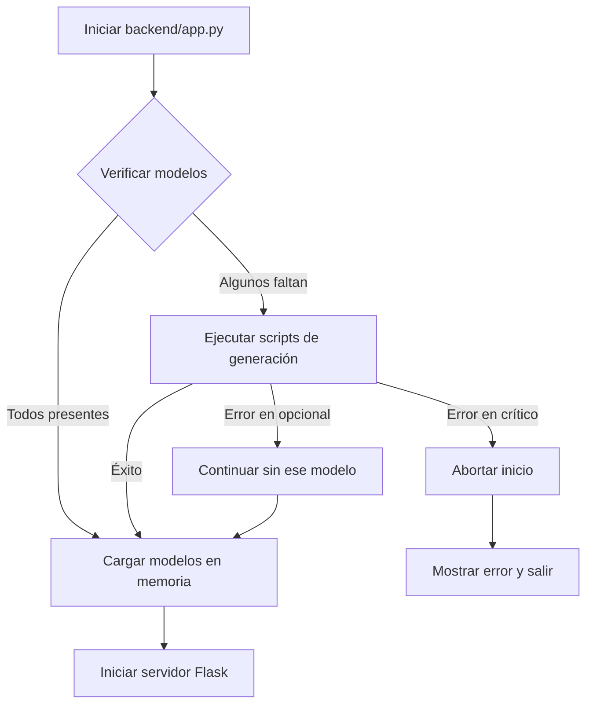

# 🤖 Sistema de Auto-Generación de Modelos

## 📋 Descripción

El backend ahora cuenta con un **sistema de auto-generación de modelos** que verifica automáticamente la existencia de todos los archivos `.pkl` necesarios antes de iniciar el servidor. Si detecta que algún archivo falta, ejecuta los scripts de generación correspondientes.

## ✨ Características

### 1. **Verificación Automática al Iniciar**
Cuando ejecutas `python backend/app.py`, el sistema:
- ✅ Verifica que todos los archivos `.pkl` necesarios existan
- 🔄 Genera automáticamente los modelos faltantes
- ⚠️ Informa si hay errores en la generación
- 🚫 NO inicia el servidor si faltan modelos críticos

### 2. **Modelos Gestionados**

El sistema gestiona 5 modelos diferentes:

| Modelo | Archivos Generados | Script | Crítico |
|--------|-------------------|--------|---------|
| **Satisfacción Salarial** | `random_forest_model.pkl`<br>`features.json`<br>`analysis_results.json` | `generate_models.py` | ✅ Sí |
| **Bien Pagado vs Promedio** | `seniority_model.pkl`<br>`seniority_features.json`<br>`seniority_analysis.json` | `generate_seniority_model.py` | ⚠️ No |
| **Búsqueda de Trabajo** | `xgboost_model.pkl`<br>`xgboost_features.json`<br>`xgboost_analysis.json` | `generate_xgboost_model.py` | ⚠️ No |
| **Predicción de Sueldo (USD)** | `regression_salary_model.pkl`<br>`regression_salary_scaler.pkl`<br>`regression_salary_features.json`<br>`regression_salary_analysis.json` | `generate_regression_model.py` | ⚠️ No |
| **Sueldo Futuro (ARS)** | `regression_futuro_model.pkl`<br>`regression_futuro_scaler.pkl`<br>`regression_futuro_features.json`<br>`regression_futuro_analysis.json` | `generate_regression_futuro.py` | ⚠️ No |

> **Nota:** Solo el modelo de "Satisfacción Salarial" es crítico. Los demás son opcionales y su ausencia no impedirá que el backend inicie.

## 🚀 Uso

### Iniciar el Backend (con verificación automática)

```bash
python backend/app.py
```

El sistema:
1. Verifica todos los modelos
2. Genera los que falten automáticamente
3. Inicia el servidor Flask

**Salida esperada:**
```
================================================================================
INICIANDO SERVIDOR BACKEND
================================================================================

================================================================================
🔍 VERIFICANDO MODELOS NECESARIOS
================================================================================

✅ Modelo de Satisfacción (Random Forest): Todos los archivos presentes
✅ Modelo de Seniority/Bien Pagado: Todos los archivos presentes
✅ Modelo XGBoost (Búsqueda de Trabajo): Todos los archivos presentes
✅ Modelo de Regresión de Sueldo (USD): Todos los archivos presentes
✅ Modelo de Regresión de Sueldo Futuro (ARS): Todos los archivos presentes

================================================================================
✅ TODOS LOS MODELOS ESTÁN DISPONIBLES

✓ Modelo de satisfacción cargado correctamente
✓ Features de satisfacción cargadas correctamente
...
```

### Verificar Manualmente los Modelos

Puedes usar el script de utilidad `verificar_modelos.py`:

```bash
python verificar_modelos.py
```

Este script te permite:
- 📊 Ver el estado de todos los modelos
- 🔄 Regenerar todos los modelos
- 🎯 Regenerar solo los modelos faltantes
- 🔧 Regenerar un modelo específico

**Menú interactivo:**
```
================================================================================
🔧 VERIFICADOR Y REGENERADOR DE MODELOS
================================================================================

================================================================================
📊 ESTADO DE MODELOS
================================================================================

✅ OK - Modelo de Satisfacción (Random Forest)
✅ OK - Modelo de Seniority/Bien Pagado
❌ INCOMPLETO - Modelo XGBoost (Búsqueda de Trabajo)
   Archivos faltantes:
      • xgboost_model.pkl
   Script de regeneración: generate_xgboost_model.py

...

❓ ¿Qué deseas hacer?
   1. Regenerar TODOS los modelos
   2. Regenerar solo los modelos faltantes
   3. Regenerar un modelo específico
   0. Salir
```

## 🛠️ Requisitos

Para que la auto-generación funcione correctamente:

1. **Archivo de datos:** `database.csv` debe existir en la raíz del proyecto
2. **Scripts de generación:** Todos los scripts `generate_*.py` deben estar presentes
3. **Dependencias:** Todas las librerías necesarias deben estar instaladas:
   ```bash
   pip install -r backend/requirements.txt
   ```

## ⚙️ Configuración Técnica

### Modificaciones en `backend/app.py`

Se agregó la función `check_and_generate_models()` que:
- Verifica la existencia de archivos `.pkl`
- Ejecuta scripts de generación mediante `subprocess`
- Maneja timeouts (5 minutos por modelo)
- Reporta errores de forma clara

### Timeout por Modelo

Cada modelo tiene un timeout de **5 minutos** para generarse. Si un modelo tarda más:
- Se cancela la ejecución
- Se reporta el timeout
- El backend puede continuar si el modelo no es crítico

## 🔍 Troubleshooting

### Problema: "Modelo no disponible" en el frontend

**Causa:** El archivo `.pkl` correspondiente no existe o falló al generarse.

**Solución:**
1. Ejecuta `python verificar_modelos.py`
2. Revisa qué modelos faltan
3. Regenera el modelo específico o todos

### Problema: Timeout al generar modelos

**Causa:** El dataset es muy grande o el hardware es limitado.

**Solución:**
1. Genera los modelos manualmente ejecutando cada script:
   ```bash
   python generate_models.py
   python generate_seniority_model.py
   python generate_xgboost_model.py
   python generate_regression_model.py
   python generate_regression_futuro.py
   ```

### Problema: Error "database.csv no encontrado"

**Causa:** El archivo de datos no está en la ubicación correcta.

**Solución:**
1. Asegúrate de que `database.csv` exista en la raíz del proyecto
2. Verifica que el archivo tenga permisos de lectura

## 📝 Logs y Debugging

El sistema imprime logs detallados:
- ✅ Modelos encontrados
- ⚠️ Modelos faltantes
- 🔄 Procesos de generación en curso
- ✅ Generación exitosa
- ❌ Errores con detalles

## 🎯 Ventajas del Sistema

1. **Automatización Completa:** No necesitas generar modelos manualmente
2. **Detección de Problemas:** Identifica modelos faltantes inmediatamente
3. **Recuperación Automática:** Regenera modelos sin intervención manual
4. **Feedback Claro:** Logs detallados de todo el proceso
5. **Robustez:** El backend no inicia si faltan modelos críticos

## 🔄 Flujo de Trabajo Típico



## 📚 Referencias

- Script principal: `backend/app.py` (función `check_and_generate_models()`)
- Script de utilidad: `verificar_modelos.py`
- Scripts de generación: `generate_*.py`

---

**Última actualización:** Noviembre 2025
